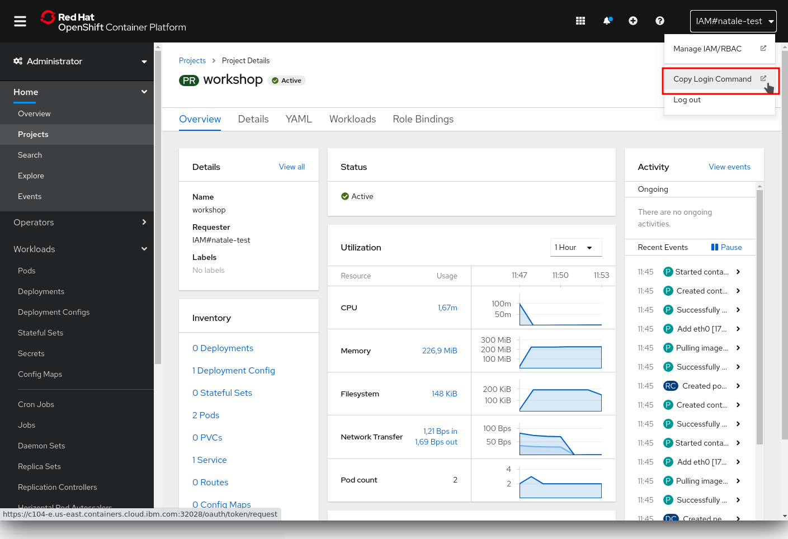
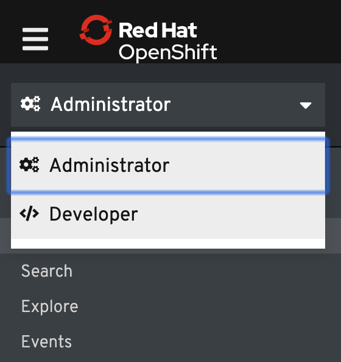

# Discover OpenShift

## Table of Content
* [Explore OpenShift](#explore-openShift)
  * [Webconsole](#webconsole)
  * [Command Line Interface](#command-line-interface)
  * [Projects & Perspectives](#projects-&-perspectives)
* [Deploying Components](#deploying-components)
  * [Deploying a Database](#deploying-a-database)
* [Monitoring](#monitoring)
  * [Built-in monitoring](#built-in-monitoring)
  * [Prometheus & ServiceMonitor](#prometheus-&-servicemonitor)
  * [Grafana dashboarding](#grafana-dashboarding)
* [Useful CLI commands](#useful-cli-commands)

## Explore OpenShift

### Webconsole

OpenShift ships with a web-based console that will allow users to perform various tasks via a browser.

The first time you access the web console, you will most likely be in the Administrator perspective. If you are also the Cluster Administrator, you will be presented with an overview of the whole Cluster status:


### Command Line Interface

OpenShift ships also a command line tools to provide users with a nice interface to work with applications deployed to the platform. The OpenShift tools are a single executable written in the Go programming language and is available for the following operating systems:

* Microsoft Windows
* Mac OS X
* Linux

```sh
$ oc version
Client Version: openshift-clients-4.3-31-gc25fb9c7
Server Version: 4.6.4
Kubernetes Version: v1.19.0+9f84db3
```

If the `oc` doesn’t exist or you have an older version of the OpenShift CLI, follow the next sections to install or update the OpenShift CLI.

#### Download CLI

From top right menu bar, click to the little white question mark icon, then click to **Command Line Tools**:


Scroll down to **oc - OpenShift Command Line Interface (CLI)**


Choose the binary corresponding to your platform. If needed, check the installation details below:

* [Download and Install OpenShift CLI on Linux](https://redhat-scholars.github.io/openshift-starter-guides/rhs-openshift-starter-guides/common-explore.html#download_and_install_openshift_cli_on_linux)
* [Download and Install OpenShift CLI on Mac OS X](https://redhat-scholars.github.io/openshift-starter-guides/rhs-openshift-starter-guides/common-explore.html#download_and_install_openshift_cli_on_mac)
* [Download and Install OpenShift CLI on Windows](./assets/https://redhat-scholars.github.io/openshift-starter-guides/rhs-openshift-starter-guides/common-explore.html#download_and_install_openshift_cli_on_windows)

#### Connect to cluster with CLI

Once your `oc` client is setup on your Workstation, you can connect to cluster and start working also with OpenShift CLI.

From Web Console overview, go to top-right menu bar and click to the dropdown menu containing your username, then click **Copy Login Command**:



Click on **Display Token** and copy the command under **Login with this token**:

```sh
$ oc login --token=some_token --server=https://c104-e.us-east.containers.cloud.ibm.com:32208

Logged into "https://c104-e.us-east.containers.cloud.ibm.com:32208" as "%USERNAME%" using the token provided.

You have access to 68 projects, the list has been suppressed. You can list all projects with 'oc projects'

Using project "default".
```

### Projects & Perspectives

Projects are a top level concept to help you organize your deployments. An OpenShift project allows a community of users (or a user) to organize and manage their content in isolation from other communities. Each project has its own resources, policies (who can or cannot perform actions), and constraints (quotas and limits on resources, etc). Projects act as a "wrapper" around all the application services and endpoints you (or your teams) are using for your work.

#### Switch Perspectives

At the top of the left navigation menu, you can toggle between the **Administrator** perspective and the **Developer** perspective.



Select **Developer** to switch to the Developer perspective. Once the Developer perspective loads, you should be in the **Topology** view.  When starting a Project, there are no applications or components to view.


#### Create a Project

You can create a project from either **Administrator** or **Developer** perspective. Just insert the name of your project in the form and click **Create**.


#### Using the CLI

You can also create and manage project from the CLI as well. Let’s use our newly created project workshop as our default one:

```sh
$ oc new-project my-own-project

$ oc project my-other-project
Now using project "my-other-project" on server "https://c104-e.us-east.containers.cloud.ibm.com:32208"
```

## Deploying Components

Once your project is created, it may be the time to add some components to it :wink: On the **Developer** perspective, you may just use the **Topology** view or the **+Add** menu on the left to add new components **From Catalog**. Once this option picked, you'll have access to the **Developer Catalog**:


Depending on your cluster installation (and the administrator willingness to offer access to services) you'll be able to consumer different kind of middleware or application services. If you need extra-services that may not be present, please have a look at [OperatorHub.io](https://operatorhub.io) that is a community marketplace for additional Kubernetes Services packaged as [Operators](https://www.redhat.com/en/topics/containers/what-is-a-kubernetes-operato).

> Maybe some of those Operators are already present on your cluster but not yet available for your project? To check this go back to the **Administrator** perspective and select **OperatorHub** in the **Operators** menu item. You may be able to activate operators for bringing new services into your project.


### Deploying a Database

Most useful applications are "stateful" or "dynamic" in some way, and this is usually achieved with a database or other data storage.

In the Developer Perspective in your project, click **+Add** and then **Databases**. You'll just see the default available databases on OpenShift in the below screenshot:


> Make sure to uncheck **Operator Backed** option from **Type** section

Let's deploy for example a **MongoDB** database! Here we are using a template - a preconfigured set of resources that includes parameters that can be customized. In our case, the parameters we are concerned with are — user, password, database, and admin password.


You can see that some of the fields say **"generated if empty"**. This is a feature of **Templates** in OpenShift. Just click **Create** and OpenShift will instantiate a containerized database for you.

If you did not explicitly set the username and password, you can retrieve the generated ones that have been stored into a `Secret`. Just go to the **Secrets** left menu and look after a secret having the same name as your database service. You can reveal the values to get actual username and password.


> Though we covered here the MongDB example, the process, parameters and secrets remain the same for other database engines like MariaDB or PostgreSQL.

## Monitoring

### Built-in monitoring

OpenShift offers built-in automatic monitoring for each and every container deployed on the platform. Using the **Monitoring** menu from the **Developer** perspective you can access standard metrics corresponding to the resources consumed by your components: CPU, Memory, Storage and Network bandwidth.


The built-in monitoring can be considered as infrastructure level monitoring of your component.

### Prometheus & ServiceMonitor

OpenShift allows to easily integrate custom application metrics by defining a new monitoring layer. For that, it is using the [Prometheus](https://prometheus.io/) metrics collector and storage engine.

Metrics collection can be integrated in a *as-code* fashion using Prometheus Operator and the `ServiceMonitor` concept. See [project official documentation](https://github.com/prometheus-operator/prometheus-operator/blob/master/Documentation/user-guides/getting-started.md).

In order to activate these features, you first have to ensure that the Prometheus Operator is installed and enabled within your project. If this is not the case, switch to the **Administrator** perspective and use the **OperatorHub** menu to install the *Prometheus Operator* as shown below:


Once the operator installed, you'll have to deploy an instance of `Prometheus` using the **Developer Catalog**. 


Default parameters of the Prometheus installation are great, just hit the **Create** button then.

Now we should be able to defined our `ServiceMonitor` that is a object holding some scraping rules for Prometheus. Is the example below, we are declaring a new endpoint to scrape and integrate into the Prometheus engine each and every 5 seconds:

```yaml
apiVersion: monitoring.coreos.com/v1
kind: ServiceMonitor
metadata:
 labels:
   k8s-app: prometheus
 name: mymonitor
 namespace: fruits-catalog-prod
spec:
 endpoints:
   - interval: 5s
     path: /actuator/prometheus
     port: 8080-tcp
 selector:
   matchLabels:
     app.kubernetes.io/instance: backend
```

Creating a `ServiceMonitor` is enough for Prometheus to start gathering and storing metrics.

### Grafana dashboarding

[Grafana](https://grafana.com/) is another tool that is integrated with OpenShift and Prometheus in order to provider visualization of the metrics stored into Prometheus.

The usage of Grafana is following the same principle as Prometheus. We first have to make sure that the Grafana Operator is installed and enabled within your project. If this is not the case, switch to the **Administrator** perspective and use the **OperatorHub** menu to install the *Grafana Operator* as shown below:


Then, once installed, you'll have to deploy a `Grafana` instance using the **Developer Catalog** from the **Developer** perspective like illustrated below:


> We recommend setting an administrator username and password if you want to use Grafana in interactive mode.

In order to link our new Grafana instance to the previous Prometheus one, we have to defined a `GrafanaDataSource` so that the metrics collecte by Prometheus will be available for visualization through Grafana:

```yaml
apiVersion: integreatly.org/v1alpha1
kind: GrafanaDataSource
metadata:
  name: fruits-grafanadatasource
spec:
  name: middleware.yaml
  datasources:
    - name: Prometheus
      type: prometheus
      access: proxy
      url: http://prometheus-operated:9090
      isDefault: true
      version: 1
      editable: true
      jsonData:
        tlsSkipVerify: true
        timeInterval: "5s"
```

From here, you can just start using Grafana in interactive mode, crafting new dashboard after having sign-in. Or - if you already have ready to use dashboards - you can just insert them within your instance by declaring them within a `GrafanaDashboard` object like below. Just create this object in your project and the Grafana Operator will take care of importing it into the instance!

```yaml
apiVersion: integreatly.org/v1alpha1
kind: GrafanaDashboard
metadata:
  name: fruits-monitoring-dashboard
  labels:
    app: grafana
spec:
  name: fruits-dashboard.json
  json: >
    {
      "__inputs": [
        {
          "name": "DS_PROMETHEUS",
          "label": "Prometheus",
          "description": "",
          "type": "datasource",
          "pluginId": "prometheus",
          "pluginName": "Prometheus"
        }
      ],
      "__requires": [
        {
          "type": "grafana",
          "id": "grafana",
          "name": "Grafana",
          "version": "6.2.4"
        },
        {
          "type": "panel",
          "id": "graph",
          "name": "Graph",
          "version": ""
        },
        {
          "type": "datasource",
          "id": "prometheus",
          "name": "Prometheus",
          "version": "1.0.0"
        },
        {
          "type": "panel",
          "id": "singlestat",
          "name": "Singlestat",
          "version": ""
        }
      ],
      "annotations": {
        "list": [
          {
            "builtIn": 1,
            "datasource": "-- Grafana --",
            "enable": true,
            "hide": true,
            "iconColor": "rgba(0, 211, 255, 1)",
            "name": "Annotations & Alerts",
            "type": "dashboard"
          }
        ]
      },
      "editable": true,
      "gnetId": null,
      "graphTooltip": 0,
      "id": null,
      "links": [],
      "panels": [
        {
          "collapsed": false,
          "gridPos": {
            "h": 1,
            "w": 24,
            "x": 0,
            "y": 0
          },
          "id": 10,
          "panels": [],
          "title": "Invocations",
          "type": "row"
        },
        {
          "cacheTimeout": null,
          "colorBackground": false,
          "colorValue": false,
          "colors": [
            "#299c46",
            "rgba(237, 129, 40, 0.89)",
            "#d44a3a"
          ],
          "datasource": "Prometheus",
          "format": "none",
          "gauge": {
            "maxValue": 100,
            "minValue": 0,
            "show": false,
            "thresholdLabels": false,
            "thresholdMarkers": true
          },
          "gridPos": {
            "h": 3,
            "w": 8,
            "x": 0,
            "y": 1
          },
          "id": 16,
          "interval": null,
          "links": [],
          "mappingType": 1,
          "mappingTypes": [
            {
              "name": "value to text",
              "value": 1
            },
            {
              "name": "range to text",
              "value": 2
            }
          ],
          "maxDataPoints": 100,
          "nullPointMode": "connected",
          "nullText": null,
          "options": {},
          "postfix": "",
          "postfixFontSize": "50%",
          "prefix": "",
          "prefixFontSize": "50%",
          "rangeMaps": [
            {
              "from": "null",
              "text": "N/A",
              "to": "null"
            }
          ],
          "sparkline": {
            "fillColor": "rgba(31, 118, 189, 0.18)",
            "full": false,
            "lineColor": "rgb(31, 120, 193)",
            "show": false
          },
          "tableColumn": "",
          "targets": [
            {
              "expr": "http_server_requests_seconds_count{exception=\"None\",method=\"GET\",outcome=\"SUCCESS\",status=\"200\",uri=\"/api/fruits\",}",
              "format": "time_series",
              "instant": true,
              "intervalFactor": 1,
              "refId": "A"
            }
          ],
          "thresholds": "",
          "title": "Fruits API invocations",
          "type": "singlestat",
          "valueFontSize": "80%",
          "valueMaps": [
            {
              "op": "=",
              "text": "N/A",
              "value": "null"
            }
          ],
          "valueName": "avg"
        },
        {
          "collapsed": false,
          "gridPos": {
            "h": 1,
            "w": 24,
            "x": 0,
            "y": 4
          },
          "id": 8,
          "panels": [],
          "title": "Response Times",
          "type": "row"
        },
        {
          "aliasColors": {},
          "bars": false,
          "dashLength": 10,
          "dashes": false,
          "datasource": "Prometheus",
          "fill": 1,
          "gridPos": {
            "h": 11,
            "w": 8,
            "x": 0,
            "y": 5
          },
          "id": 4,
          "legend": {
            "avg": false,
            "current": false,
            "max": false,
            "min": false,
            "show": true,
            "total": false,
            "values": false
          },
          "lines": true,
          "linewidth": 1,
          "links": [],
          "nullPointMode": "null",
          "options": {},
          "percentage": false,
          "pointradius": 5,
          "points": false,
          "renderer": "flot",
          "seriesOverrides": [],
          "spaceLength": 10,
          "stack": false,
          "steppedLine": false,
          "targets": [
            {
              "expr": "http_server_requests_seconds_sum{exception=\"None\",method=\"GET\",outcome=\"SUCCESS\",status=\"200\",uri=\"/api/fruits\",} / http_server_requests_seconds_count{exception=\"None\",method=\"GET\",outcome=\"SUCCESS\",status=\"200\",uri=\"/api/fruits\",}",
              "format": "time_series",
              "intervalFactor": 1,
              "legendFormat": "Mean response time",
              "refId": "A"
            }
          ],
          "thresholds": [],
          "timeFrom": null,
          "timeRegions": [],
          "timeShift": null,
          "title": "Fruits API - Response Times",
          "tooltip": {
            "shared": true,
            "sort": 0,
            "value_type": "individual"
          },
          "type": "graph",
          "xaxis": {
            "buckets": null,
            "mode": "time",
            "name": null,
            "show": true,
            "values": []
          },
          "yaxes": [
            {
              "format": "short",
              "label": null,
              "logBase": 1,
              "max": null,
              "min": null,
              "show": true
            },
            {
              "format": "short",
              "label": null,
              "logBase": 1,
              "max": null,
              "min": null,
              "show": true
            }
          ],
          "yaxis": {
            "align": false,
            "alignLevel": null
          }
        },
        {
          "collapsed": false,
          "gridPos": {
            "h": 1,
            "w": 24,
            "x": 0,
            "y": 16
          },
          "id": 20,
          "panels": [],
          "title": "JVM insights",
          "type": "row"
        },
        {
          "aliasColors": {},
          "bars": false,
          "dashLength": 10,
          "dashes": false,
          "datasource": "Prometheus",
          "fill": 1,
          "gridPos": {
            "h": 4,
            "w": 8,
            "x": 0,
            "y": 17
          },
          "id": 22,
          "legend": {
            "avg": false,
            "current": false,
            "max": false,
            "min": false,
            "show": true,
            "total": false,
            "values": false
          },
          "lines": true,
          "linewidth": 1,
          "links": [],
          "nullPointMode": "null",
          "options": {},
          "percentage": false,
          "pointradius": 5,
          "points": false,
          "renderer": "flot",
          "seriesOverrides": [],
          "spaceLength": 10,
          "stack": false,
          "steppedLine": false,
          "targets": [
            {
              "expr": "jvm_memory_used_bytes{endpoint=\"8080-tcp\", area=\"heap\"}",
              "format": "time_series",
              "intervalFactor": 1,
              "legendFormat": "{{id}}",
              "refId": "A"
            }
          ],
          "thresholds": [],
          "timeFrom": null,
          "timeRegions": [],
          "timeShift": null,
          "title": "Backend JVM",
          "tooltip": {
            "shared": true,
            "sort": 0,
            "value_type": "individual"
          },
          "type": "graph",
          "xaxis": {
            "buckets": null,
            "mode": "time",
            "name": null,
            "show": true,
            "values": []
          },
          "yaxes": [
            {
              "format": "short",
              "label": null,
              "logBase": 1,
              "max": null,
              "min": null,
              "show": true
            },
            {
              "format": "short",
              "label": null,
              "logBase": 1,
              "max": null,
              "min": null,
              "show": true
            }
          ],
          "yaxis": {
            "align": false,
            "alignLevel": null
          }
        }
      ],
      "refresh": "5s",
      "schemaVersion": 18,
      "style": "dark",
      "tags": [],
      "templating": {
        "list": []
      },
      "time": {
        "from": "now-5m",
        "to": "now"
      },
      "timepicker": {
        "refresh_intervals": [
          "5s",
          "10s",
          "30s",
          "1m",
          "5m",
          "15m",
          "30m",
          "1h",
          "2h",
          "1d"
        ],
        "time_options": [
          "5m",
          "15m",
          "1h",
          "6h",
          "12h",
          "24h",
          "2d",
          "7d",
          "30d"
        ]
      },
      "timezone": "",
      "title": "Fruits Catalog Monitoring",
      "uid": "W_6VDplmz",
      "version": 7
    }
```

## Useful CLI commands


### Manipulating Pods

List pods (without and with nodes):

```sh
oc get pods
oc get pods -o wide
```

Follow pod logs:

```sh
oc logs -f $POD_NAME
```

Exec command into pod:

```sh
oc exec $POD_NAME $COMMAND
```

Interacting directly with the container is simple with `oc rsh`:

```sh
$ oc rsh ruby-ex-5-kgzvd
sh-4.2$ ls
Gemfile Gemfile.lock README.md bundle config.ru
```
